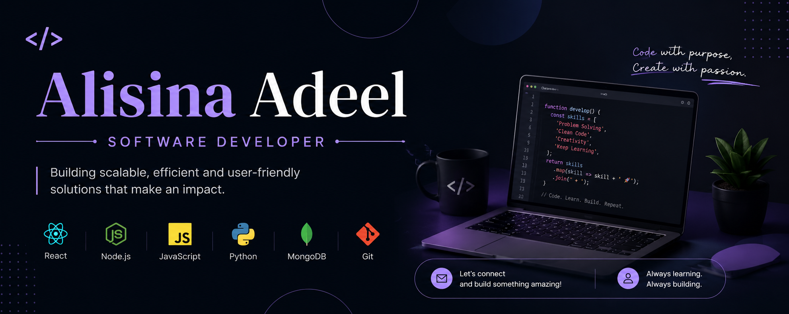

  
  
  

  

<h1 align="center">Hi, I'm Alisina Adeel 👋</h1>

  Full-Stack Developer • React • Node.js • MongoDB

  Building modern web applications and turning ideas into real-world solutions.

---

## 🚀 Featured Projects

### 🔹 Real-Time Live Hiring, Verification & Fraud Detection System
Trust-based recruitment platform with real-time hiring, user verification, fraud detection, and post-hiring validation.

🔗 Repository: https://huntigox.com/

### 🔹 Portfolio Website
Personal portfolio showcasing projects, skills, and experience.

🔗 Repository: https://studio-delta-ashen-30.vercel.app/

### 🔹 Full-Stack Web Application
Developed and maintained websites using WordPress.

🔗 Repository: https://goto.network/chair/

---

## 💻 Tech Stack

**Frontend**  
React • JavaScript • TypeScript • Tailwind CSS

**Backend**  
Node.js • Express.js • REST APIs

**Database**  
MongoDB • PostgreSQL

**Tools**  
Git • GitHub • Postman • VS Code

---

## 🌱 Currently Learning

- Advanced React
- System Design
- Cloud Technologies
- AI-Powered Applications

---

## 📫 Connect

💼 LinkedIn: www.linkedin.com/in/alisina-adeel

📧 Email: Alisinaadeel@icloud.com

---

  <i>"Building simple, scalable, and meaningful software."</i>

